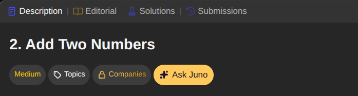
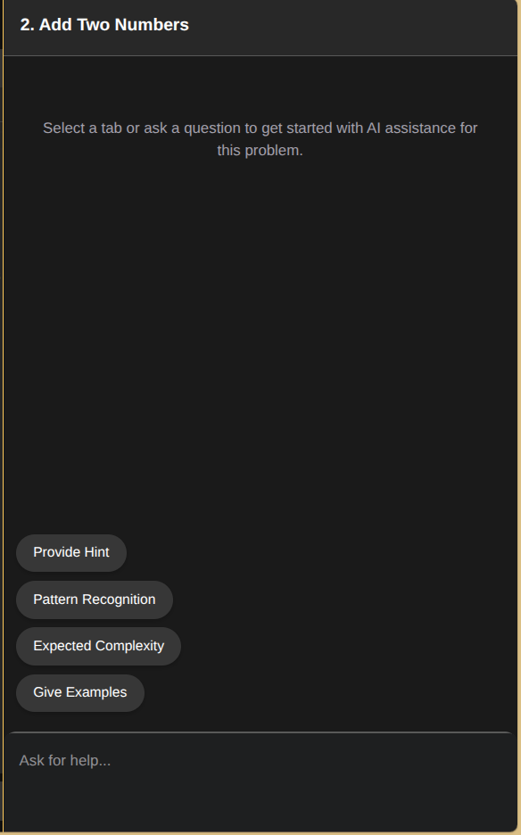
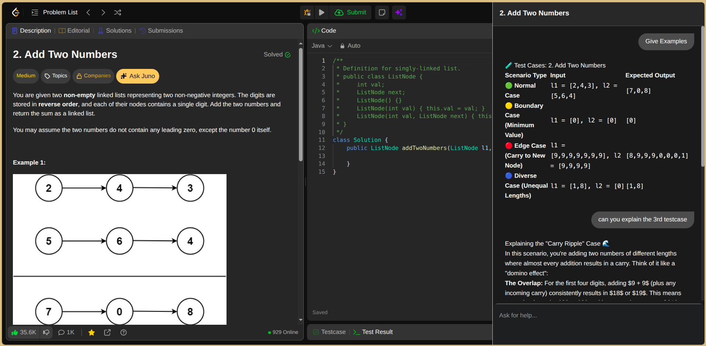
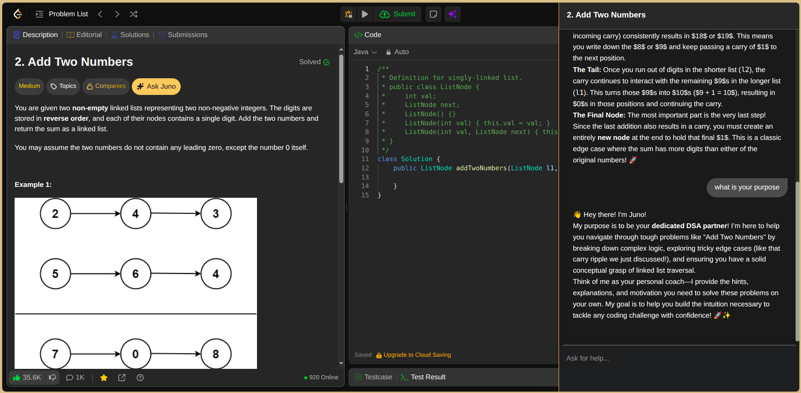

# 🪐 Juno — LeetCode AI Companion
**Juno** is a **Chrome Extension** designed to bridge the gap between struggling on a problem and looking up the solution. Unlike standard AI bots, Juno acts as a patient tutor, guiding you toward the optimal logic through Socratic hints rather than just handing over the code.

## ✨ Key Features
- **Conceptual Hints:** Get nudges in the right direction without seeing the final implementation.

- **Multi-turn Chat:** Ask follow-up questions regarding any problem to clarify your understanding.

- **Expected Complexity:** Quickly compare brute-force vs. optimal time and space complexity.

- **Pattern Recognition:** Identify the underlying algorithm (e.g., Sliding Window, Two-Pointer) and see related problems.

- **Test Case Generator:** Get a curated table of normal, edge, and boundary cases to dry-run your logic.

## 🛠️ Tech Stack
- **Core:** JavaScript (Vanilla JS)

- **AI Engine:** Google Gemini 3 Flash API

- **Formatting:** Marked.js for high-fidelity Markdown-to-HTML rendering.

- **Platform:** Chrome Extension Manifest V3

## 📸 Screenshots
<table width="100%">
  <tr>
    <td width="50%" align="center">
      <b>Chat Panel Toggle Button</b> 
      
    </td>
    <td width="30%" align="center">
      <b>Chat Panel</b> 
      
    </td>
  </tr>
  <tr>
    <td width="50%" align="center">
      <b>Interactive Chat</b> 
      
    </td>
    <td width="50%" align="center">
      <b>Interactive Chat</b> 
      
    </td>
  </tr>
</table>
